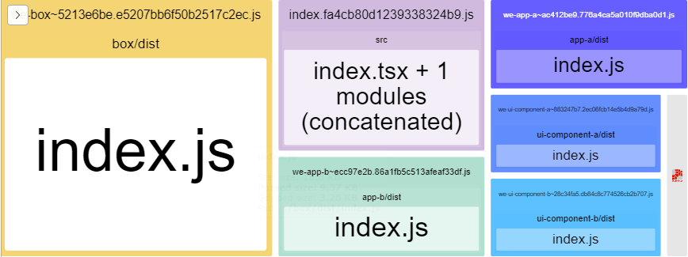

# A Monorepo Modular React App powered by Webpack code splitting and Yarn Workspaces

> This project gives you an option of how to configure a monorepo for a modular React App and use webpack to generate a single chunk for each package and lazy load them.

Feel free to ask and make PR's 👍

## Tech Stack
* React 18.2.0
* Webpack 5.78.0
* Yarn (and yarn workspaces)
* Styled Components

## Requirements
* Node v16.20.1
* Yarn v1.22.19
* Cygwin in case you are running this project on a windows machine

## Packages
* `app-a`, and `app-b`: These two packages are like business modules. You can dev and run them standalone but in the production they are instantiated by the `root-app`;
* `root-app`: The main app. This app provides infrastructure to all modules via React Context API like the <Theme/> . Also, it handles the routing at its first level;
* `dev-tools`: A shared module that provides tooling and general config.


## Setup
```
$ yarn install
```

## Building

```
$ sh scripts/build.sh
```
> If all goes well your browser will open and show you a report of how webpack split the code like this:
> 
> 


## Running
```
$ yarn http-server
```
> Open your browser on http://localhost:8080. If you wanna see the lazy loading in action look at the networking 

## Running `App-A` and `App-B` standalone
You can run the business modules standalone in dev mode.
```
$ cd packages/app-a
$ yarn start
```
> Live reloading is enabled

## Keep in mind
  * `Yarn Workspaces` is the key that makes the development experience better:
    * You can keep the root `package.json` free of dependencies. Eventually, you can put some global tools there like Lerna but those shared dev dependencies like webpack go inside the `dev-tools` package.
    * Yarn workspaces will take care about making the `dev-tools` binaries accessible inside the packages that depend on it;
    * Almost all dependencies will be hosted inside the root _node_modules_ saving a lot of disk space and internet connection.
  * `Webpack` enables you to do whatever you want with your bundling as we've done here:
    * Generating 1 chunk file per package.
    * The chunks filename remains the same unless its source code changes. So we're taking advantage of the browser's cache. Courtesy of webpack's `contenthash` feature;
    * You can share common dependencies like `react` in a vendor bundle keeping your components chunks small and avoiding duplicated code;
    * Webpack's async import() will do the lazy loading job.
    * The vendor package is not splitted because it's just a demo. A good way of split it is making dozens of small chunks in case your http-server is powered by HTTP/2.
    
